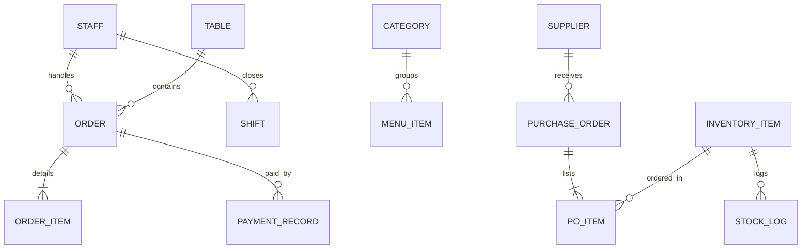

# Product Requirements Document (PRD): Project Alberta
**Next-Generation Thai SME Restaurant POS & Store Management Platform**

---

## 1. Executive Summary & Vision
- **Product Name:** Project Alberta (Tailored for Thai SME Restaurants e.g., "ตุ๋นมัน พระราม 3")
- **Target Market:** SME Thai Dine-in restaurants, quick-service eateries, noodle shops, and cafes.
- **Core Vision:** An ultra-fast, offline-resilient, tablet-and-desktop optimized Point of Sale (POS) and Enterprise Back-Office system. Project Alberta unifies rapid storefront ordering, floor management, live kitchen orchestration, comprehensive inventory/PO tracking, and owner-only financial analytics into a seamless, high-performance web and tablet experience.

---

## 2. User Roles & Permission Matrix (RBAC)

The system enforces strict Role-Based Access Control (RBAC) across all storefront and back-office modules via 4-digit PIN authentication:

| Feature / Module | Owner / Admin | Store Manager | Cashier / Server | Kitchen Staff |
| :--- | :---: | :---: | :---: | :---: |
| **Storefront POS (Order & Tables)** | ✅ Full Access | ✅ Full Access | ✅ Full Access | ❌ |
| **Kitchen KDS View** | ✅ View / Act | ✅ View / Act | ❌ | ✅ Full Access |
| **1. Executive Dashboard** | 🔒 **Owner Only** | ❌ Hidden | ❌ Hidden | ❌ Hidden |
| **2. All Bill Logs** | ✅ Full + Void/Refund | ✅ Full (Void with PIN) | 👁️ View & Reprint only | ❌ |
| **3. Menu Catalog & Categories** | ✅ Full CRUD | ✅ Stock Toggle only | ❌ | ❌ |
| **4. Table Management & Layout** | ✅ Full Layout Edit | ✅ Manage Status | 👁️ Status / Seating | ❌ |
| **5. Stocking / Inventory** | ✅ Full Access | ✅ Count & Receive | 👁️ View Stock | ❌ |
| **6. Supplier Management** | 🔒 **Owner Only** | ❌ Hidden | ❌ Hidden | ❌ Hidden |
| **7. Purchasing Orders (PO)** | ✅ Full CRUD & Approve| ✅ Draft & Receive | ❌ | ❌ |
| **8. Financing & Cash Drawer** | ✅ Full Access | ✅ Shift Cash In/Out | 💵 Shift In/Out & Cashier | ❌ |
| **9. Employee Info & PINs** | ✅ Full CRUD & PINs | 👁️ View Staff | ❌ | ❌ |
| **10. Employee Time Logging** | ⏸️ *(Hidden - Future)* | ⏸️ *(Hidden - Future)* | ⏸️ *(Hidden - Future)* | ⏸️ |
| **11. Reporting & Analytics** | ✅ Full Financials | 👁️ Operational Reports| ❌ | ❌ |
| **12. Settings (VAT, SC, Tax)** | ✅ Full Config | ❌ | ❌ | ❌ |
| **13. Real-time Notifications** | ✅ All Alerts | ✅ Ops / Stock Alerts | 🔔 Bill / Print Alerts | 🔔 Kitchen Alerts |

---

## 3. Comprehensive Feature Specifications

### 3.1 Executive Dashboard *(🔒 Role: Owner Only)*
*   **Executive KPI Cards:**
    *   Today's Gross Sales (ยอดขายรวม) vs Net Sales (ยอดขายสุทธิ).
    *   Order count (จำนวนบิล), Average ticket size (ยอดเฉลี่ยต่อบิล), and Average dining duration.
    *   Payment channel breakdown (เงินสด vs PromptPay QR vs บัตรเครดิต).
    *   Real-time active tables occupancy rate (`Occupied / Total`).
*   **Sales Trend & Peak Hours Heatmap:** Hourly sales distribution to optimize kitchen prep and staffing.
*   **Top 5 Best-Selling Dishes:** Real-time revenue contribution and volume rankings.
*   **Quick Financial & Ops Health Banner:** Current cash in drawer vs expected float, pending purchase orders, and critical low-stock items.

---

### 3.2 All Bill Logs (ประวัติและบันทึกบิลทั้งหมด)
*   **Historical Bill Registry:** Full searchable transaction archive with filters:
    *   Date/Time range, Table number, Staff cashier, Payment status (`Paid`, `Voided`, `Refunded`), and Payment method.
*   **Detailed Bill Breakdown Modal:**
    *   Ordered items with SKU, quantity, unit price, modifiers, and item notes.
    *   VAT calculation (Inclusive / Exclusive) and Service Charge audit.
    *   Staff who opened the order, cashier who received payment, and timestamp history.
*   **Bill Operations:**
    *   **1-Click Reprint Receipt / Tax Invoice:** Generates 80mm thermal receipt format instantly without disruptive confirmation dialogs.
    *   **Void / Refund Workflow:** Requires Manager/Owner PIN override with mandatory reason logging (e.g., "Customer cancelled", "Kitchen error", "Wrong table").
    *   **Audit Trail:** Immutable record of voided items and discounts.

---

### 3.3 Menu Catalog Management & Category Grouping (จัดการเมนูและหมวดหมู่)
*   **Hierarchical Category Grouping:**
    *   Category creation with customizable display order, Thai/English names, and icon/emoji tagging (e.g. 🍜 เมนูหลัก, 🥤 เครื่องดื่ม, 🍲 ของทานเล่น).
*   **SKU & Item Configuration:**
    *   SKU Code generation (e.g., `NDL-R`, `NDL-L`, `KLO-R`, `SIDE-LJ`).
    *   Bilingual Name (TH/EN), standard price, short description, item image URL.
    *   **Instant Stock Availability Toggle:** Cashier/Manager can flip item to "หมด (Out of Stock)" in one click, immediately reflecting on POS catalog and preventing kitchen backorders.
*   **Recipe & Modifier Integration:** Support for zero-delta options (e.g. ธรรมดา / พิเศษ / จัมโบ้) and modifier groups.

---

### 3.4 Table Management & Visual Floor Plan (จัดการผังโต๊ะร้านค้า)
*   **Interactive Floor Plan Editor:**
    *   Visual drag-and-drop grid canvas with coordinate snap (`blockCol`, `blockRow`).
    *   Add, rename, resize, and position table cards.
    *   **Quick Delete Table:** Dedicated trash button on table cards and within Edit modal with custom confirmation modal.
    *   Default standardized capacity: **4 seats per table (`capacity: 4`)**.
*   **Storefront Table Map (Full & Compact Modes):**
    *   Color-coded real-time status badges:
        *   🟩 **ว่าง (Available/Open)**
        *   🟧 **มีลูกค้า / กำลังรับประทาน (Occupied / Dining)**
        *   🟦 **เรียกเช็คบิล / พิมพ์บิลแล้ว (Bill Requested / Billed)**
    *   Seated time timer (e.g., "42 นาที") and live order total preview on table card.
    *   Table operations: Merge tables (รวมโต๊ะ) and Move/Transfer table (ย้ายโต๊ะ).

---

### 3.5 Stocking & Inventory (ระบบคลังและสต็อกวัตถุดิบ/สินค้า)
*   **Dual-Layer Inventory System:**
    *   **Retail / Ready-to-Serve Stock:** Direct inventory decrement on order payment (e.g., bottled Coke, Sprite, bottled water, canned drinks).
    *   **Raw Ingredient Stock (วัตถุดิบครัว):** Meat (เนื้อสด/เนื้อตุ๋น kg), Noodles (เส้นก๋วยเตี๋ยว kg), Broth bases, Vegetables, Condiments.
*   **Inventory Tracking Metrics:**
    *   Current quantity on hand (สต็อกคงเหลือ), Unit of Measure (kg, pcs, packs, bottles).
    *   Minimum reorder safety threshold (จุดสั่งซื้อซ้ำ).
    *   Average cost per unit (ต้นทุนเฉลี่ย).
*   **Stock Movements & Adjustments:**
    *   **Stock In (รับเข้า):** Automated increment via PO Receiving.
    *   **Stock Adjust / Waste (ปรับยอด / วัตถุดิบเสีย):** Waste logging with reason (Spoiled, Expired, Staff meal, Count adjustment).

---

### 3.6 Supplier Management *(🔒 Role: Owner Only)*
*   **Centralized Supplier Directory:**
    *   Supplier Company / Vendor Name, Contact person, Phone numbers, LINE ID, Email, Address.
    *   Supply Categories (e.g., "ผู้จำหน่ายเนื้อวัวสด", "เครื่องดื่มและน้ำอัดลม", "ผักสดตลาดเช้า", "บรรจุภัณฑ์และของใช้").
*   **Commercial Terms:**
    *   Payment terms (Cash on Delivery, Credit 15/30/60 Days, PromptPay Transfer).
    *   Bank account details for vendor payouts.
    *   Order history and cumulative purchase volume per vendor.

---

### 3.7 Purchasing Orders (PO / ใบสั่งซื้อสินค้า)
*   **PO Creation & Workflow:**
    *   `Draft (ร่าง)` -> `Submitted / Sent to Supplier (ส่งใบสั่งซื้อ)` -> `Partially Received (รับสินค้าบางส่วน)` -> `Completed (รับสินค้าครบถ้วน)` -> `Cancelled (ยกเลิก)`.
*   **Automated Stock Ingestion:**
    *   When a PO is marked as "Received (รับของเข้าคลัง)", the system automatically increments the inventory on-hand balance and logs the acquisition cost.
*   **Printable / PDF PO Form:** Generates formal purchase order with restaurant tax information, supplier details, delivery date, itemized list, and approval signature lines.

---

### 3.8 Financing & Cash Flow (ระบบการเงินและกะการทำงาน)
*   **Shift & Cash Drawer Management:**
    *   **Opening Float (เงินทอนตั้งต้น):** Cashier logs beginning float upon opening shift (e.g., ฿2,000).
    *   **Pay-In / Pay-Out Tracking:** Instant logging for petty cash disbursements (e.g., "ซื้อน้ำแข็งหลอด ฿150", "ซื้อผักสดด่วน ฿200") with staff attribution.
    *   **Blind End-of-Day (EOD) Reconciliation:** Cashier enters actual counted cash; system calculates over/short variance (`เงินขาด/เงินเกิน`) against expected total sales + float - pay-outs.
*   **Payment Gateway & Channel Segregation:**
    *   Cash transactions with live change calculator and quick buttons (Exact, ฿500, ฿1,000).
    *   PromptPay QR payment with reference number recording.
    *   Credit/Debit card settlement tracking.
*   **Tax & Surcharges Accounting:**
    *   Separation of Subtotal, VAT (7%), and Service Charge (10%) based on system settings.

---

### 3.9 Employee Information & Security
*   **Employee Directory:**
    *   Staff Name, Assigned Role (`Admin/Owner`, `Manager`, `Cashier`, `Kitchen Staff`), Phone number, Start date.
*   **Security & PIN Pad Authentication:**
    *   Unique 4-digit PIN per staff member for rapid user switching on shared tablet POS.
    *   Fast switch lock screen to prevent unauthorized discounts, refunds, or table edits.

---

### 3.10 Employee Time Logging *(⏸️ Future Phase - UI Hidden initially)*
*   **Clock-In / Clock-Out Flow:**
    *   Time stamp logging upon entering staff PIN at shift start and shift end.
    *   Break tracking (พักเบรค).
*   **Timesheet & Attendance Records:**
    *   Total hours worked calculation, overtime (OT) tracking.
    *   *(Specification prepared in architecture; UI tab hidden until Phase 2 release)*.

---

### 3.11 Reporting & Analytics (รายงานสรุปยอดขายและการวิเคราะห์)
*   **Sales Reports:**
    *   Daily, Weekly, Monthly, and Custom date-range sales summaries.
    *   Sales breakdown by Category, Item SKU, Hour of the day, and Staff member.
*   **Financial & Tax Reports:**
    *   Monthly VAT Summary Report (รายงานภาษีขาย ภ.พ.30) ready for accounting.
    *   Cash discrepancy report (Shift Over/Short history).
*   **Export Capabilities:** CSV and printable PDF export for accountant handoff.

---

### 3.12 Settings (ตั้งค่าระบบและร้านค้า)
*   **Store Profile:**
    *   Thai & English restaurant name, branch name, Tax ID (เลขประจำตัวผู้เสียภาษี), Store address, Contact phone numbers.
*   **Payment & PromptPay Settings:**
    *   PromptPay ID (Mobile/Tax ID) and Registered PromptPay account name.
*   **Tax & Surcharges Configuration:**
    *   **VAT Toggle:** Enable/Disable VAT (7%).
    *   **VAT Mode:** Inclusive (ราคาในเมนูรวม VAT แล้ว - Thai SME standard) or Exclusive (บวก VAT เพิ่มท้ายบิล).
    *   **Service Charge Toggle:** Enable/Disable Service Charge (default 10%).
    *   *(When disabled in settings, charges are completely hidden from order panel and customer bills)*.
*   **Hardware & Layout Settings:**
    *   Thermal receipt printer width (80mm / 58mm).
    *   Default floor plan reset / backup tools.

---

### 3.13 Real-Time Notification Center (ระบบแจ้งเตือน)
*   **Operational Alerts:**
    *   🚨 **Low Stock Alert:** Instant badge notification when an ingredient/drink drops below safety threshold.
    *   🧾 **Void/Refund Alert:** Push notification to owner when a bill/item is voided.
    *   ⏰ **Long-Dining Table Alert:** Highlights tables seated over threshold (e.g. >90 mins).
    *   💰 **Shift Discrepancy Alert:** Flagged when cash drawer variance exceeds allowable threshold.
    *   📡 **Offline / Sync Status Alert:** Visual banner showing offline local caching mode and cloud sync status.

---

## 4. Technical Architecture & Data Models

### 4.1 System Architecture
*   **Frontend Engine:** React 19 + TypeScript + Vite (High-performance SPA with touch-optimized CSS).
*   **State & Storage Layer:** Context API with dual-tier storage (In-memory reactivity + immediate `localStorage` fallback for offline resilience).
*   **Styling & UI Aesthetics:** Custom dark-mode glassmorphic theme designed for high contrast in restaurant ambient lighting (Thai SME aesthetic).

### 4.2 Entity Relationship Overview

---

## 5. Development Roadmap & Phasing

| Phase | Core Deliverables | Status |
| :--- | :--- | :---: |
| **Phase 1 (Current)** | Complete Dine-in POS, Table Map & Layout Canvas, Menu Catalog, Cash & PromptPay Flow, Settings, Owner Dashboard, Bill Logs | 🚀 **Active** |
| **Phase 2** | Inventory Stocking, Supplier Directory, Purchasing Orders (PO), Advanced Financial Analytics, Notification Center | 🛠️ **In Progress** |
| **Phase 3** | Employee Time Clocking (Active UI), Delivery Aggregator API integration (Grab/LINE MAN), Cloud Sync Backend | 📅 **Planned** |

---
*Document maintained by Project Alberta Core Product & Architecture Team.*
